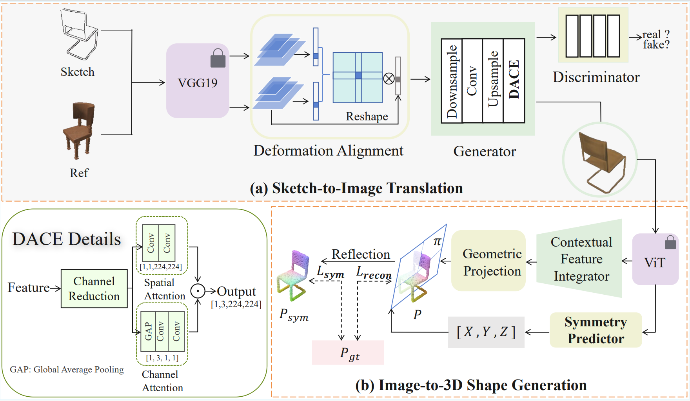

# Sketch2Symm: Symmetry-Aware Sketch-to-Shape Generation via Semantic Bridging

Official implementation of the paper:

> **Sketch2Symm: Symmetry-Aware Sketch-to-Shape Generation via Semantic Bridging**  
> Yan Zhou¹, Mingji Li²*, Xiantao Zeng², Jie Lin¹, Yuexia Zhou¹  
> ¹School of Electronic Information Engineering, Foshan University, Guangdong, China  
> ²School of Computer Science and Artificial Intelligence, Foshan University, Guangdong, China  

---

## 🔍 Overview

Sketch-based 3D reconstruction is a challenging task due to the abstract and sparse nature of sketches, which often lack sufficient semantic and geometric information.  
To tackle this issue, **Sketch2Symm** proposes a **two-stage semantic bridging framework**:

1. **Stage 1: Sketch-to-Image Translation** — enriches semantic content from sparse sketches.  
2. **Stage 2: Image-to-Shape Generation** — reconstructs geometrically consistent 3D shapes with a **symmetry-aware constraint** to enhance structure plausibility.

This approach effectively bridges the gap between abstract sketches and realistic 3D shapes, achieving notable improvements in accuracy, completeness, and structural consistency.

The overall workflow is as follows:

Visualization of qualitative comparison on the ShapeNet-Synthetic dataset using **synthetic sketches**:

Visualization of qualitative comparison on the ShapeNet-Sketch dataset using **hand-drawn sketches**:

Qualitative comparison with diffusion-based methods on synthetic and hand-drawn sketches:

---

## 📊 Results

| Category    | CD(10^3)↓ |
| ----------- | --------- |
| Car         | 2.10      |
| Sofa        | 4.70      |
| Airplane    | 1.50      |
| Bench       | 5.00      |
| Display     | 5.70      |
| Chair       | 5.00      |
| Table       | 7.50      |
| Telephone   | 2.60      |
| Cabinet     | 8.50      |
| Loudspeaker | 10.80     |
| Watercraft  | 3.40      |
| Lamp        | 7.90      |
| Rifle       | 1.70      |
| Average     | 5.11      |

---

## 📝 License & Acknowledgment

© 2026 IEEE. Personal use of this material is permitted. Permission from IEEE must be obtained for all other uses, in any current or future media, including reprinting/republishing this material for advertising or promotional purposes, creating new collective works, for resale or redistribution to servers or lists, or reuse of any copyrighted component of this work in other works.

---

⭐️ *If you find this repository useful, please consider giving it a star!*
